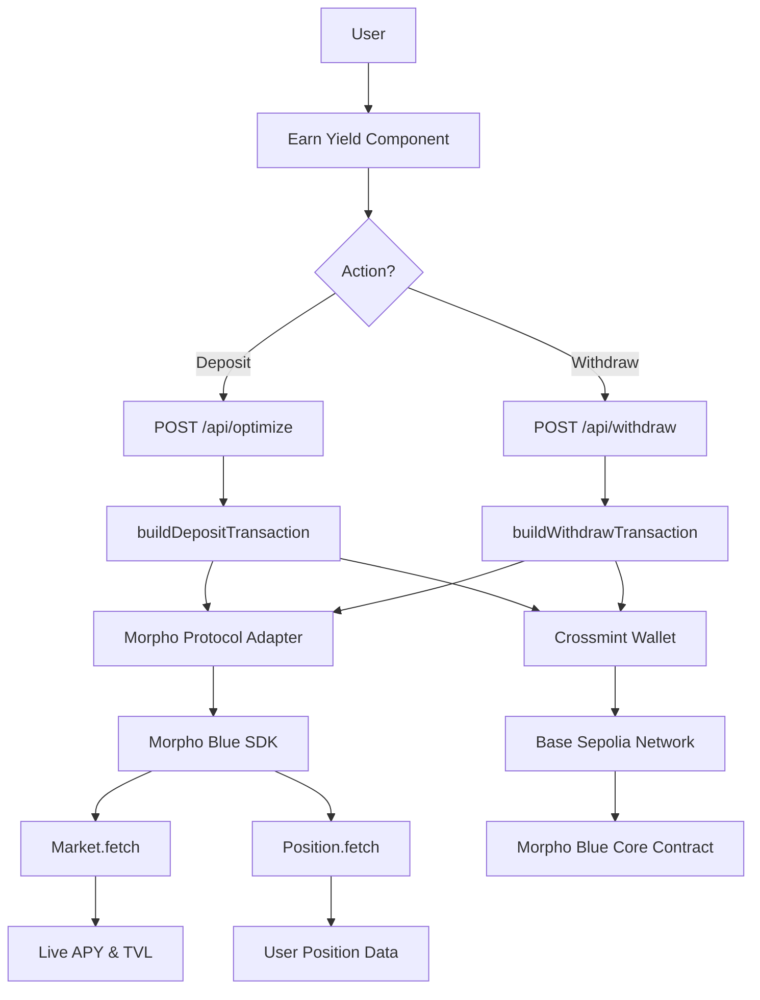

# Morpho USDC Yield - Base Sepolia Setup Guide

This guide walks you through completing the USDC yield integration on Base Sepolia testnet.

## 🎯 Current Status

✅ **Completed:**

- Morpho Blue SDK integrated (`@morpho-org/blue-sdk`)
- Custom addresses registered for Base Sepolia
- Market parameters configured (supply-only USDC market)
- Refactored protocol adapter to use SDK methods
- Live APY fetching from on-chain data
- Deposit transaction builder (approval + supply)
- Withdrawal transaction builder
- Withdrawal API endpoint (`/api/withdraw`)
- Withdrawal UI in PositionsList component
- Comprehensive documentation

⚠️ **Requires User Action:**

1. Install Morpho Bundler SDK package
2. Deploy test market on Base Sepolia (or use mainnet)
3. Fund wallet with Sepolia ETH and test USDC
4. Test deposit and withdrawal flows

---

## 📦 Step 1: Install Missing Package

The Morpho Bundler SDK is referenced but not yet installed. Install it with:

```bash
pnpm add @morpho-org/bundler-sdk-viem
```

**Note:** The bundler SDK is optional. The current implementation uses manual transaction encoding which works fine. The bundler SDK can optimize multi-step transactions into batched calls, but for now the sequential approach (approve → supply) is functional.

---

## 🚀 Step 2: Deploy Test Market (Base Sepolia)

### Option A: Deploy Your Own Market

1. **Get Sepolia ETH**:

   - Visit [Base Sepolia Faucet](https://www.base.org/faucet)
   - Request testnet ETH for gas

2. **Set up deployer private key**:

   ```bash
   # Add to .env
   DEPLOYER_PRIVATE_KEY=0x...your-private-key
   ```

3. **Run deployment script**:

   ```bash
   pnpm tsx scripts/deploy-morpho-market.ts
   ```

4. **Verify deployment**:
   - Check transaction on [Base Sepolia Explorer](https://sepolia.basescan.org)
   - Market should be created with params from `lib/yield-optimizer/config.ts`

### Option B: Switch to Base Mainnet (Recommended)

If you want to test with real Morpho markets:

1. **Update `.env`**:

   ```bash
   NEXT_PUBLIC_CHAIN_ID=base
   ```

2. **Update `lib/yield-optimizer/config.ts`**:

   ```typescript
   export const CHAIN_CONFIG = {
     chainId: 8453, // Base mainnet
     name: "Base",
     rpcUrl: "https://mainnet.base.org",
   };
   ```

3. **Update SDK registration**:

   ```typescript
   registerCustomAddresses({
     addresses: {
       8453: {
         // Base mainnet
         morpho: "0xBBBBBbbBBb9cC5e90e3b3Af64bdAF62C37EEFFCb",
         // ... other addresses from Morpho docs
       },
     },
   });
   ```

4. **Get real market params**:
   - Visit [Morpho Markets](https://app.morpho.org)
   - Find active USDC market on Base
   - Update `MORPHO_USDC_MARKET_PARAMS` in config

---

## 🧪 Step 3: Test the Integration

### A. Test Deposit Flow

1. **Start dev server**:

   ```bash
   pnpm dev
   ```

2. **Login to app**:

   - Use Crossmint authentication
   - Ensure wallet has USDC balance

3. **Navigate to "Earn Yield"**:

   - Should see Morpho USDC opportunity with live APY
   - Click deposit button

4. **Execute deposit**:
   - Enter amount (e.g., 10 USDC)
   - Confirm approval transaction
   - Confirm supply transaction
   - Position should appear in "My Positions" tab

### B. Test Withdrawal Flow

1. **Go to "My Positions" tab**:

   - Should see your active Morpho position
   - Shows shares, assets, and current APY

2. **Click "Exit Position"**:

   - Withdrawal transaction is built
   - Single transaction (no approval needed)
   - USDC returns to wallet

3. **Verify balance**:
   - Wallet balance should increase
   - Position removed from list

---

## 🔍 Verification Checklist

- [ ] Morpho opportunity shows **live APY** (not 4.5% estimate)
- [ ] Deposit creates transaction with correct market params
- [ ] Transactions execute successfully on Base Sepolia
- [ ] Position appears with correct share and asset amounts
- [ ] Withdrawal returns USDC to wallet
- [ ] No console errors during deposit/withdrawal

---

## 📊 Architecture Overview



---

## 🛠️ Troubleshooting

### Issue: "Market not available"

**Cause:** Test market not deployed on Base Sepolia.

**Solutions:**

1. Run deployment script (Step 2A above)
2. Switch to Base mainnet (Step 2B)
3. Check if market was created successfully on explorer

### Issue: "Insufficient gas"

**Cause:** Wallet has no Sepolia ETH.

**Solution:** Get testnet ETH from Base Sepolia faucet.

### Issue: "Transaction reverted"

**Causes:**

- Insufficient USDC balance
- Market params incorrect
- Contract not approved

**Debug:**

1. Check USDC balance in wallet
2. Verify market params in config match deployed market
3. Check approval transaction succeeded before supply

### Issue: "No APY showing"

**Cause:** Market has no activity or SDK fetch failed.

**Solutions:**

1. Check console for errors
2. Verify market exists on-chain
3. Add fallback APY estimate if needed

---

## 📁 Modified Files Summary

### New Files

1. `scripts/deploy-morpho-market.ts` - Market deployment script
2. `app/api/withdraw/route.ts` - Withdrawal API endpoint
3. `MORPHO_SETUP_GUIDE.md` - This file

### Modified Files

1. `lib/yield-optimizer/config.ts`

   - Added SDK address registration
   - Added `MORPHO_USDC_MARKET_PARAMS`
   - Added IRM address to protocols config

2. `lib/yield-optimizer/protocols/morpho.ts`

   - Imported Morpho Blue SDK
   - Refactored `findActiveUsdcMarket()` to use SDK
   - Updated `getMorphoOpportunities()` with live APY
   - Updated `getMorphoPosition()` with SDK position fetching
   - Updated transaction builders

3. `lib/yield-optimizer/executor.ts`

   - Updated imports for refactored Morpho functions
   - Implemented `buildWithdrawTransaction()` with full logic
   - Added Aave withdrawal support

4. `components/earn-yield/PositionsList.tsx`

   - Updated `handleExit()` to use `/api/withdraw` endpoint
   - Removed unused import
   - Added proper shares handling

5. `lib/yield-optimizer/README.md`
   - Updated protocol status table
   - Added SDK integration section
   - Added Base Sepolia setup instructions
   - Documented supply-only market configuration

---

## 🚀 Next Steps After Setup

Once the basic integration is working:

### 1. Enable Aave Protocol

- Find Base Sepolia Aave v3 deployment (if available)
- Update config with pool addresses
- Enable in protocols config
- Test deposits/withdrawals

### 2. Enable Moonwell Protocol

- Requires Base mainnet (not on Sepolia)
- Update config with Moonwell addresses
- Enable in protocols config

### 3. Add Auto-Rebalancing

- Integrate GOAT SDK for autonomous execution
- Create cron endpoint for periodic optimization
- Add server-side transaction signing
- Set rebalance thresholds

### 4. Production Deployment

- Switch to Base mainnet
- Set up proper RPC provider (Alchemy, Infura)
- Configure production environment variables
- Add monitoring and alerting
- Set up analytics tracking

### 5. Enhanced Features

- Historical APY charts
- Position performance tracking
- Multiple asset support (USDT, DAI, etc.)
- Gas optimization strategies
- Transaction history

---

## 📚 Resources

### Morpho Documentation

- [Morpho Blue Docs](https://docs.morpho.org)
- [Blue SDK Documentation](https://legacy.docs.morpho.org/sdks/blue-sdk/)
- [Contract Addresses](https://docs.morpho.org/get-started/resources/addresses/)

### Base Network

- [Base Sepolia Faucet](https://www.base.org/faucet)
- [Base Sepolia Explorer](https://sepolia.basescan.org)
- [Base Documentation](https://docs.base.org)

### Crossmint

- [Crossmint SDK Docs](https://docs.crossmint.com)
- [EVM Wallet Guide](https://docs.crossmint.com/wallets/evm)

---

## ✅ Success Criteria

Your implementation is complete when:

1. ✅ Deposits execute successfully on Base Sepolia
2. ✅ Positions show with correct share/asset amounts
3. ✅ Live APY displays from on-chain data
4. ✅ Withdrawals return USDC to wallet
5. ✅ No console errors during normal operation
6. ✅ UI shows clear feedback for all states (loading, success, error)

---

## 🆘 Support

If you encounter issues:

1. Check console logs for detailed error messages
2. Verify all environment variables are set
3. Confirm wallet has sufficient gas (Sepolia ETH)
4. Review transaction on Base Sepolia explorer
5. Check Morpho contract events for failures

**Happy Building! 🎉**
